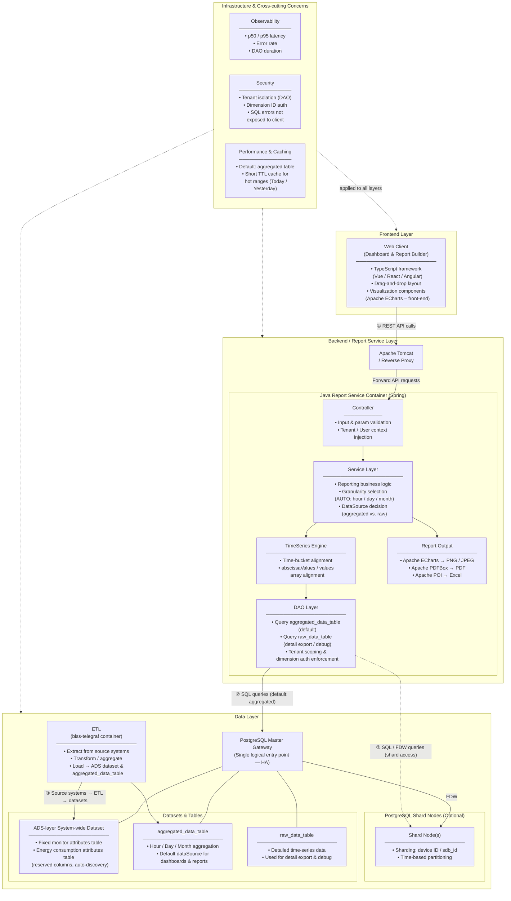

# BLSS Report Platform — Architecture Diagram

The BLSS Report Platform enables non-developer users to design, publish, and consume customer-specific reports through a self-service designer built on the existing Dashboard module. It is delivered by the BLSS ART Tiger Team in PI12 and spans a web client, a Java-based report service, and a PostgreSQL data layer — all containerised and governed by shared observability and security controls.

---

## Architecture Diagram

---

## Legend & Notes

| Symbol | Meaning |
|--------|---------|
| Solid arrow `→` | Primary data / request flow |
| Dashed arrow `-.->` | Optional path or cross-cutting association |
| `①` REST API calls | HTTP/HTTPS requests from the Web Client to the Reverse Proxy / Report Service |
| `②` SQL / FDW queries | DAO queries to PostgreSQL Master; FDW-forwarded queries to optional shard nodes |
| `③` ETL flow | blss-telegraf container extracts from source systems, transforms, and writes to ADS-layer datasets and aggregated tables |

### Optional Components
- **PostgreSQL Shard Nodes** — deployed only when data volume or multi-tenancy requires horizontal partitioning; accessed by the Master Gateway via Foreign Data Wrapper (FDW).
- **Report Output sub-modules** (PDFBox / POI) — invoked only on explicit export actions (PDF / Excel); Apache ECharts image generation is also used for scheduled report previews.

### Key Design Decisions
- The DAO Layer enforces **tenant isolation and dimension-level authorisation** at query time; SQL error details are never surfaced to the client.
- The Service Layer applies an **AUTO granularity strategy** (hour → day → month) based on the requested time range, defaulting queries to `aggregated_data_table` for performance.
- A **short-TTL cache** covers hot time ranges (Today / Yesterday) to reduce database load on frequent dashboard refreshes.
- All runtime components (Frontend, Java Report Service, blss-telegraf ETL, PostgreSQL) are deployed as **Docker containers** to ensure consistent environments across stages.
